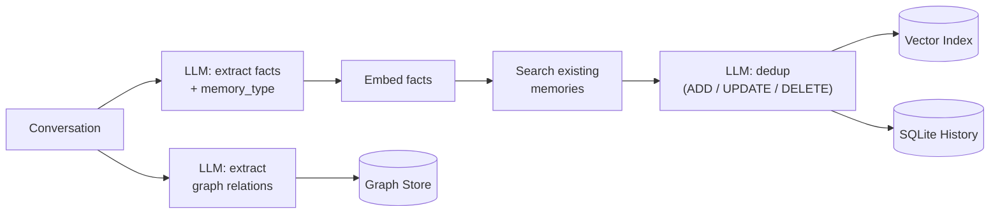
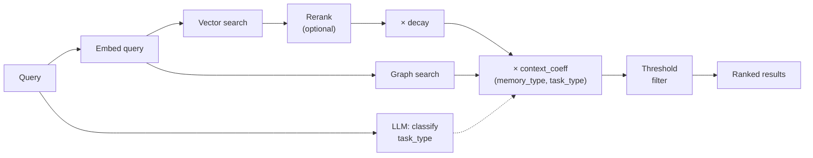

<p align="center">
  
</p>

<h1 align="center">mem7</h1>

<p align="center">LLM-powered long-term memory engine — Rust core with multi-language bindings.</p>

Deeply inspired by [Mem0](https://mem0.ai/), mem7 reimplements the core memory pipeline in Rust and goes further with two capabilities Mem0 doesn't have:

- **Ebbinghaus forgetting curve** — stale memories naturally decay over time while frequently recalled facts grow stronger, just like human memory.
- **Session-aware recall** — each memory is typed (factual / preference / procedural / episodic) and each query is auto-classified by task intent, so irrelevant memories (e.g. design preferences during bug-fixing) are demoted before they reach the agent.

mem7 extracts factual statements from conversations, deduplicates them against existing memories, and stores the results in vector + graph databases with full audit history.

## Install

```bash
pip install mem7          # Python
npm install @mem7ai/mem7  # Node.js / TypeScript
cargo add mem7            # Rust
```

## Architecture

```
Python / TypeScript / Rust API
    │  PyO3 (sync + async) / napi-rs / native
    ▼
Rust Core (tokio async runtime)
    ├── mem7-llm        — OpenAI-compatible LLM client
    ├── mem7-embedding  — Embedding client (OpenAI-compatible / FastEmbed)
    ├── mem7-vector     — Vector index (FlatIndex / Upstash)
    ├── mem7-graph      — Graph store (FlatGraph / Kuzu / Neo4j)
    ├── mem7-history    — SQLite audit trail
    ├── mem7-dedup      — LLM-driven memory deduplication
    ├── mem7-reranker   — Search reranking (Cohere / LLM-based)
    ├── mem7-telemetry  — OpenTelemetry tracing (OTLP export)
    └── mem7-store      — Pipeline orchestrator (MemoryEngine)
```

### Write Path — `add()`



### Read Path — `search()`



## Quick Start (Python — Sync)

```python
from mem7 import Memory
from mem7.config import MemoryConfig, LlmConfig, EmbeddingConfig

config = MemoryConfig(
    llm=LlmConfig(
        base_url="http://localhost:11434/v1",
        api_key="ollama",
        model="qwen2.5:7b",
    ),
    embedding=EmbeddingConfig(
        base_url="http://localhost:11434/v1",
        api_key="ollama",
        model="mxbai-embed-large",
        dims=1024,
    ),
)

m = Memory(config=config)
m.add("I love playing tennis and my coach is Sarah.", user_id="alice")
results = m.search("What sports does Alice play?", user_id="alice")
```

## Quick Start (Python — Async)

```python
import asyncio
from mem7 import AsyncMemory
from mem7.config import MemoryConfig, LlmConfig, EmbeddingConfig

async def main():
    config = MemoryConfig(
        llm=LlmConfig(
            base_url="http://localhost:11434/v1",
            api_key="ollama",
            model="qwen2.5:7b",
        ),
        embedding=EmbeddingConfig(
            base_url="http://localhost:11434/v1",
            api_key="ollama",
            model="mxbai-embed-large",
            dims=1024,
        ),
    )

    m = await AsyncMemory.create(config=config)
    await m.add("I love playing tennis and my coach is Sarah.", user_id="alice")
    results = await m.search("What sports does Alice play?", user_id="alice")

asyncio.run(main())
```

## Quick Start (TypeScript)

```typescript
import { MemoryEngine } from "@mem7ai/mem7";

const engine = await MemoryEngine.create(JSON.stringify({
  llm: { base_url: "http://localhost:11434/v1", api_key: "ollama", model: "qwen2.5:7b" },
  embedding: { base_url: "http://localhost:11434/v1", api_key: "ollama", model: "mxbai-embed-large", dims: 1024 },
}));

await engine.add([{ role: "user", content: "I love playing tennis and my coach is Sarah." }], "alice");
const results = await engine.search("What sports does Alice play?", "alice");
```

## Supported Providers

mem7 uses a single **OpenAI-compatible client** for both LLM and Embedding, which covers any service that exposes the OpenAI API format. This includes most major providers out of the box.

### LLMs


| Provider     | Status             | Notes                     |
| ------------ | ------------------ | ------------------------- |
| OpenAI       | :white_check_mark: | Native support            |
| Ollama       | :white_check_mark: | Via OpenAI-compatible API |
| vLLM         | :white_check_mark: | Via OpenAI-compatible API |
| Groq         | :white_check_mark: | Via OpenAI-compatible API |
| Together     | :white_check_mark: | Via OpenAI-compatible API |
| DeepSeek     | :white_check_mark: | Via OpenAI-compatible API |
| xAI (Grok)   | :white_check_mark: | Via OpenAI-compatible API |
| LM Studio    | :white_check_mark: | Via OpenAI-compatible API |
| Azure OpenAI | :white_check_mark: | Via OpenAI-compatible API |
| Anthropic    | :x:                | Requires native SDK       |
| Gemini       | :x:                | Requires native SDK       |
| Vertex AI    | :x:                | Requires native SDK       |
| AWS Bedrock  | :x:                | Requires native SDK       |
| LiteLLM      | :x:                | Python proxy              |
| Sarvam       | :x:                | Requires native SDK       |
| LangChain    | :x:                | Python framework          |


### Embeddings


| Provider     | Status             | Notes                                           |
| ------------ | ------------------ | ----------------------------------------------- |
| OpenAI       | :white_check_mark: | Native support                                  |
| Ollama       | :white_check_mark: | Via OpenAI-compatible API                       |
| Together     | :white_check_mark: | Via OpenAI-compatible API                       |
| LM Studio    | :white_check_mark: | Via OpenAI-compatible API                       |
| Azure OpenAI | :white_check_mark: | Via OpenAI-compatible API                       |
| FastEmbed    | :white_check_mark: | Local ONNX inference (feature flag `fastembed`) |
| Hugging Face | :x:                | Requires native SDK                             |
| Gemini       | :x:                | Requires native SDK                             |
| Vertex AI    | :x:                | Requires native SDK                             |
| AWS Bedrock  | :x:                | Requires native SDK                             |
| LangChain    | :x:                | Python framework                                |


### Vector Stores


| Provider                | Status             | Notes                  |
| ----------------------- | ------------------ | ---------------------- |
| In-memory (FlatIndex)   | :white_check_mark: | Built-in, good for dev |
| Upstash Vector          | :white_check_mark: | REST API, serverless   |
| Qdrant                  | :x:                |                        |
| Chroma                  | :x:                |                        |
| pgvector                | :x:                |                        |
| Milvus                  | :x:                |                        |
| Pinecone                | :x:                |                        |
| Redis                   | :x:                |                        |
| Weaviate                | :x:                |                        |
| Elasticsearch           | :x:                |                        |
| OpenSearch              | :x:                |                        |
| FAISS                   | :x:                |                        |
| MongoDB                 | :x:                |                        |
| Supabase                | :x:                |                        |
| Azure AI Search         | :x:                |                        |
| Vertex AI Vector Search | :x:                |                        |
| Databricks              | :x:                |                        |
| Cassandra               | :x:                |                        |
| S3 Vectors              | :x:                |                        |
| Baidu                   | :x:                |                        |
| Neptune                 | :x:                |                        |
| Valkey                  | :x:                |                        |
| LangChain               | :x:                |                        |


### Rerankers


| Provider      | Status             | Notes                     |
| ------------- | ------------------ | ------------------------- |
| Cohere        | :white_check_mark: | Cohere v2 rerank API      |
| LLM-based     | :white_check_mark: | Any OpenAI-compatible LLM |
| Jina AI       | :x:                | Planned                   |
| Cross-encoder | :x:                | Planned                   |


### Graph Stores


| Provider              | Status             | Notes                                                |
| --------------------- | ------------------ | ---------------------------------------------------- |
| In-memory (FlatGraph) | :white_check_mark: | Built-in, good for dev/testing                       |
| Kuzu (embedded)       | :white_check_mark: | Cypher-based, no server needed (feature flag `kuzu`) |
| Neo4j                 | :white_check_mark: | Production-grade, Bolt protocol                      |
| Memgraph              | :x:                | Planned                                              |
| Amazon Neptune        | :x:                | Planned                                              |


### Language Bindings


| Language              | Status                                             |
| --------------------- | -------------------------------------------------- |
| Python (sync + async) | :white_check_mark: PyPI: `pip install mem7`        |
| TypeScript / Node.js  | :white_check_mark: npm: `npm install @mem7ai/mem7` |
| Rust                  | :white_check_mark: crates.io: `cargo add mem7`     |
| Go                    | Planned                                            |


## Vector Store Backends

**Built-in FlatIndex** (default) — in-memory brute-force, good for development:

```python
from mem7.config import VectorConfig

VectorConfig(provider="flat", dims=1024)
```

**Upstash Vector** — managed cloud vector database:

```python
VectorConfig(
    provider="upstash",
    collection_name="my-namespace",
    dims=1024,
    upstash_url="https://your-index.upstash.io",
    upstash_token="your-token",
)
```

## Local Embedding (FastEmbed)

mem7 supports fully local embedding via [FastEmbed](https://github.com/Anush008/fastembed-rs) (ONNX Runtime). No API calls needed — models are downloaded and run locally.

Requires the `fastembed` feature flag:

```toml
# Cargo.toml
mem7 = { version = "0.2", features = ["fastembed"] }
```

```python
from mem7 import Memory
from mem7.config import MemoryConfig, LlmConfig, EmbeddingConfig

config = MemoryConfig(
    llm=LlmConfig(base_url="http://localhost:11434/v1", api_key="ollama", model="qwen2.5:7b"),
    embedding=EmbeddingConfig(
        provider="fastembed",
        model="AllMiniLML6V2",  # or "BGEBaseENV15", "NomicEmbedTextV15", etc.
        dims=384,
    ),
)

m = Memory(config=config)  # model downloaded on first use
```

Supported models include `AllMiniLML6V2`, `BGEBaseENV15`, `BGESmallENV15`, `NomicEmbedTextV1`, `MxbaiEmbedLargeV1`, `GTEBaseENV15`, and their quantized variants.

## Graph Memory (Dual-Path Recall)

When `graph` is configured, mem7 runs **dual-path recall**: vector search and graph search execute concurrently via `tokio::join!`, returning both factual memories and entity relations.

On `add()`, the engine extracts entities and relations from conversations using LLM (JSON mode) and stores them in the graph alongside the vector memories.

**FlatGraph** (in-memory, for development):

```python
from mem7 import Memory
from mem7.config import MemoryConfig, LlmConfig, EmbeddingConfig, GraphConfig

config = MemoryConfig(
    llm=LlmConfig(base_url="http://localhost:11434/v1", api_key="ollama", model="qwen2.5:7b"),
    embedding=EmbeddingConfig(base_url="http://localhost:11434/v1", api_key="ollama", model="mxbai-embed-large", dims=1024),
    graph=GraphConfig(provider="flat"),
)

m = Memory(config=config)
m.add("I love playing tennis and my coach is Sarah.", user_id="alice")

results = m.search("What sports does Alice play?", user_id="alice")
# results["memories"]   -> vector search results
# results["relations"]  -> graph relations (e.g. USER -[loves_playing]-> tennis)
```

**Neo4j** (production):

```python
GraphConfig(
    provider="neo4j",
    neo4j_url="bolt://localhost:7687",
    neo4j_username="neo4j",
    neo4j_password="password",
)
```

**Kuzu** (embedded, requires `kuzu` feature flag):

```python
GraphConfig(provider="kuzu", kuzu_db_path="./my_graph.kuzu")
```

The graph LLM can be configured separately (e.g. use a cheaper model for extraction):

```python
GraphConfig(
    provider="flat",
    llm=LlmConfig(base_url="http://localhost:11434/v1", api_key="ollama", model="qwen2.5:3b"),
)
```

## Memory Decay (Forgetting Curve)

mem7 implements an Ebbinghaus-inspired **forgetting curve** that deprioritizes stale memories over time while automatically strengthening memories that are frequently recalled — just like human memory.

When enabled, every memory carries two extra metadata fields: `last_accessed_at` (the last time it was written or retrieved) and `access_count` (how many times it has been retrieved). These are used to compute a **retention score** that modulates the raw similarity score during search and dedup:

$$S = S_0 \cdot \bigl(1 + \alpha \cdot \ln(1 + n)\bigr)$$

$$R(t) = \exp\!\Bigl(-\Bigl(\frac{t - \tau}{S}\Bigr)^{\!\gamma}\Bigr)$$

$$\widetilde{R}(t) = \rho + (1 - \rho) \cdot R(t)$$

$$\text{score}_{\text{final}} = \text{sim}_{\text{raw}} \times \widetilde{R}(t)$$

where $S_0$ = base half-life, $\alpha$ = rehearsal factor, $n$ = access count, $\tau$ = last accessed time, $\gamma$ = decay shape, $\rho$ = min retention floor.

- **Decay over time**: memories you haven't touched in weeks get deprioritized, but never disappear (the `floor` parameter ensures a minimum retention of 10% by default).
- **Rehearsal strengthening**: each time a memory is successfully retrieved via `search()`, its `access_count` is incremented and `last_accessed_at` is reset asynchronously — making it harder to forget next time.
- **Cue-dependent retrieval**: a highly relevant query naturally "wakes up" old memories because `raw_similarity` is high, even if the retention score is low. No separate sigmoid gate is needed — the multiplicative structure handles it.
- **Write-path aware**: decay is also applied during the dedup phase of `add()`, so stale memories appear less "close" to new facts and are more likely to be updated or replaced.

### Enabling Decay

Decay is **off by default**. Enable it via config:

**Python:**

```python
from mem7.config import MemoryConfig, DecayConfig

config = MemoryConfig(
    # ... llm, embedding, etc.
    decay=DecayConfig(enabled=True),
)
```

**TypeScript:**

```typescript
const engine = await MemoryEngine.create(JSON.stringify({
  // ... llm, embedding, etc.
  decay: { enabled: true },
}));
```

**Rust:**

```rust
use mem7_config::{MemoryEngineConfig, DecayConfig};

let config = MemoryEngineConfig {
    decay: Some(DecayConfig { enabled: true, ..Default::default() }),
    ..Default::default()
};
```

### Tuning Parameters

| Parameter             | Default    | Description                                                       |
| --------------------- | ---------- | ----------------------------------------------------------------- |
| `base_half_life_secs` | `604800.0` | Base stability in seconds (7 days) before any rehearsal bonus     |
| `decay_shape`         | `0.8`      | Stretched-exponential shape (0 < gamma <= 1); lower = slower initial decay |
| `min_retention`       | `0.1`      | Floor so no memory fully vanishes                                 |
| `rehearsal_factor`    | `0.5`      | How much each retrieval increases stability                       |

### Backward Compatibility

- Old memories without `last_accessed_at` or `access_count` gracefully degrade: age falls back to `updated_at` then `created_at`, and access count defaults to 0.
- No migration needed — new fields are written on the next `add()` or `update()` call.
- When decay is disabled (the default), scoring behavior is identical to previous versions.

## Context-Aware Scoring (Session-Aware Recall)

Pure embedding similarity can conflate semantic closeness with contextual relevance — for example, a design preference like "always investigate root cause first" may score high when searching "fix Chrome CDP bug" because both relate to debugging. With context-aware scoring, mem7 automatically classifies queries and memories to boost what's relevant and demote what isn't.

### How It Works

1. **Write path** — each extracted fact is tagged with a `memory_type` (factual, preference, procedural, episodic) during LLM fact extraction.
2. **Read path** — each search query is classified into a `task_type` (troubleshooting, design, factual_lookup, planning, general) via a lightweight LLM call that runs **in parallel** with embedding, adding zero sequential latency.
3. A **context coefficient** is looked up from a `(memory_type, task_type)` weight matrix and multiplied into the score:

$$\text{score}_{\text{final}} = \text{similarity} \times \text{decay} \times \text{context coeff}$$

### Default Weight Matrix

|               | troubleshooting | design | factual_lookup | planning | general |
|---------------|:-:|:-:|:-:|:-:|:-:|
| **factual**   | 1.0 | 0.5 | 1.0 | 0.7 | 1.0 |
| **preference**| 0.3 | 1.0 | 0.3 | 0.8 | 0.8 |
| **procedural**| 0.8 | 0.5 | 0.5 | 1.0 | 0.7 |
| **episodic**  | 0.5 | 0.5 | 0.5 | 0.5 | 0.7 |

### Enabling Context-Aware Scoring

Context scoring is **off by default**. Enable it via config:

**Python:**

```python
from mem7.config import MemoryConfig, ContextConfig

config = MemoryConfig(
    # ... llm, embedding, etc.
    context=ContextConfig(enabled=True),
)
```

**TypeScript:**

```typescript
const engine = await MemoryEngine.create(JSON.stringify({
  // ... llm, embedding, etc.
  context: { enabled: true },
}));
```

**Rust:**

```rust
use mem7_config::{MemoryEngineConfig, ContextConfig};

let config = MemoryEngineConfig {
    context: Some(ContextConfig { enabled: true, ..Default::default() }),
    ..Default::default()
};
```

You can also provide custom weights to override the defaults:

```python
ContextConfig(
    enabled=True,
    weights={
        "preference": {"troubleshooting": 0.1, "design": 1.0},
    },
)
```

### Overriding Task Type

If the caller already knows the task context, it can pass `task_type` directly to skip the LLM classification call:

```python
results = m.search("fix Chrome CDP timeout", user_id="alice", task_type="troubleshooting")
```

### Backward Compatibility

- Context scoring defaults to disabled — zero impact on existing users.
- Old memories without `memory_type` are treated as `"factual"` (safe default).
- When context is disabled, the scoring pipeline is identical to previous versions.

## OpenClaw Plugin

mem7 ships an official [OpenClaw](https://github.com/nicepkg/openclaw) memory plugin that replaces the built-in memory backend with LLM-powered fact extraction, graph relations, dedup, and the forgetting curve — all driven by mem7's Rust core.

### Install

```bash
openclaw plugins install @mem7ai/openclaw-mem7
```

### Activate

In `~/.openclaw/openclaw.json`:

```json
{
  "plugins": {
    "slots": { "memory": "openclaw-mem7" },
    "entries": {
      "openclaw-mem7": {
        "enabled": true,
        "config": {
          "llm": { "base_url": "http://localhost:11434/v1", "api_key": "ollama", "model": "qwen2.5:7b" },
          "embedding": { "base_url": "http://localhost:11434/v1", "api_key": "ollama", "model": "mxbai-embed-large", "dims": 1024 },
          "graph": { "provider": "flat" },
          "decay": { "enabled": true }
        }
      }
    }
  }
}
```

### What it does

- **Auto-recall** (`before_prompt_build` / `before_agent_start`): before each agent turn, the plugin searches both session and long-term scopes, merges the results, and injects them into the system prompt.
- **Auto-capture** (`agent_end`): after each turn, the user + assistant messages are sent through mem7's fact extraction pipeline, automatically storing new facts and deduplicating against existing ones.
- **Tools**: the plugin registers `memory_search`, `memory_get`, `memory_list`, `memory_store`, and `memory_forget` for explicit memory operations.
- **Scope model**: tools support `session`, `long-term`, and merged `all` reads, with `sessionKey` automatically mapped onto `runId` and optional `agentId`.
- **Forgetting curve**: decay is enabled by default so stale facts naturally fade, while frequently recalled memories stay strong.

See [`packages/openclaw-mem7/`](packages/openclaw-mem7/) for full documentation.

## Observability (OpenTelemetry)

mem7 integrates with [OpenTelemetry](https://opentelemetry.io/) via `tracing-opentelemetry`. When enabled, every `add()`, `search()`, `get()`, `update()`, `delete()` call emits a trace span that is exported via OTLP/gRPC to any compatible collector (Jaeger, Grafana Tempo, Datadog, etc.).

**Python:**

```python
from mem7 import Memory, init_telemetry, shutdown_telemetry

init_telemetry(otlp_endpoint="http://localhost:4317", service_name="my-app")

m = Memory(config=config)
m.add("I love playing tennis.", user_id="alice")
# spans are exported automatically

shutdown_telemetry()  # flush before exit
```

**TypeScript:**

```typescript
import { MemoryEngine, initTelemetry, shutdownTelemetry } from "@mem7ai/mem7";

initTelemetry(JSON.stringify({ otlp_endpoint: "http://localhost:4317", service_name: "my-app" }));

const engine = await MemoryEngine.create(configJson);
await engine.add([{ role: "user", content: "I love tennis." }], "alice");

shutdownTelemetry();
```

**Rust** (requires `otel` feature):

```rust
// Cargo.toml: mem7 = { version = "0.2", features = ["otel"] }
use mem7::{TelemetryConfig, telemetry};

telemetry::init(&TelemetryConfig::default())?;
// ... use MemoryEngine as usual ...
telemetry::shutdown();
```

## Examples

See the [examples/](examples/) directory:

- [mem7_demo.ipynb](examples/mem7_demo.ipynb) — Python notebook demo
- [mem7_demo.ts](examples/mem7_demo.ts) — TypeScript demo

## Development

### Prerequisites

- Rust 1.85+ (stable)
- Python 3.10+
- Node.js 22+
- [just](https://github.com/casey/just)
- [maturin](https://github.com/PyO3/maturin)

### Build

```bash
python -m venv .venv && source .venv/bin/activate
pip install maturin pydantic

# Development build (debug, fast iteration)
just dev

# Release build
just build

# OpenClaw plugin build
just openclaw-build
```

### Test

```bash
# Full validation suite
just check

# Common individual tasks
just fmt
just fmt-check
just clippy
just lint
just typecheck
just test
```

## License

Apache-2.0